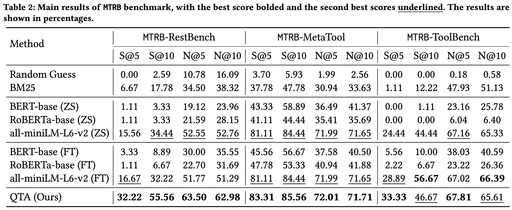

# MTRB-QTA

Data-Efficient Massive Tool Retrieval: A Reinforcement Learning Approach for Query-Tool Alignment with Language Models

## Background

The current approach to solving tool-based problems involves first addressing the (a) massive tool retrieval (MTR) task, followed by completing the (b) tool selection task. We focus on providing a solution for the MTR task. For evaluation, we introduce a new MTRB benchmark. Method-ologically, we propose a new QTA framework to enhance the retrieval systems by aligning user queries with tools.

## Overview

An overview of the proposed QTA framework, which includes data pipelines for the training and inference stages. Specifically, we utilize an LLM to learn the alignment between user queries and tool document representations, thereby generating high-quality user queries. Additionally, we employ a frozen retrieval model to compute the similarity between the queries and the tool database.

## Resules

Main results of MTRB benchmark, with the best score bolded and the second best scores underlined. The results are shown in percentages.

As shown in Table 2, we compare various methods on MTRB bench- mark across three sub-task: MTRB-RestBench, MTRB-ToolBench, and MTRB-MetaTool. In summary, the proposed QTA framework achieves either the best or the second-best results across all metrics.

## Visualization 

Visualization results: user query before and after rewriting in MTRB-RestBench dataset.

As shown in Table 3, we present the before and after versions of three sets of user queries, detailing the changes in the 𝑆@5 and 𝑁@5 metrics. In summary, the QTA frame-work generates high-quality queries, resulting in improvement overretrieval models.

