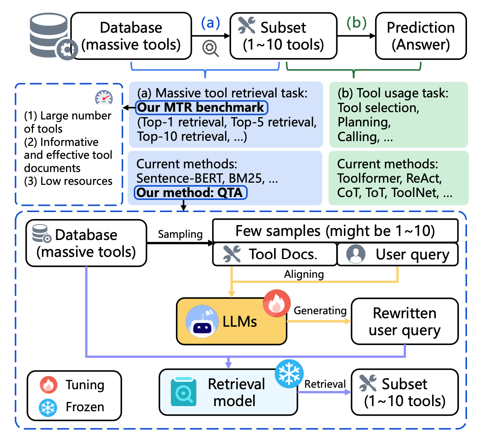
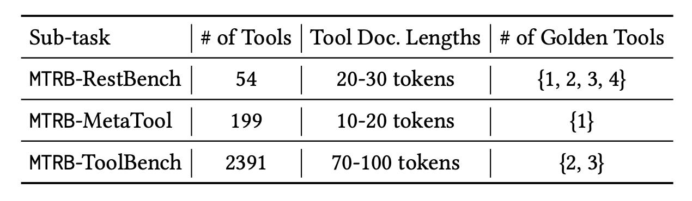
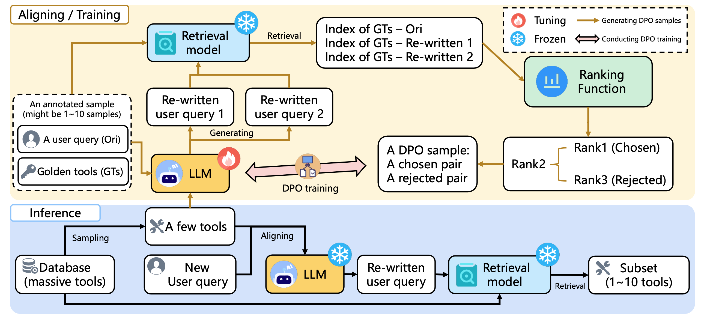
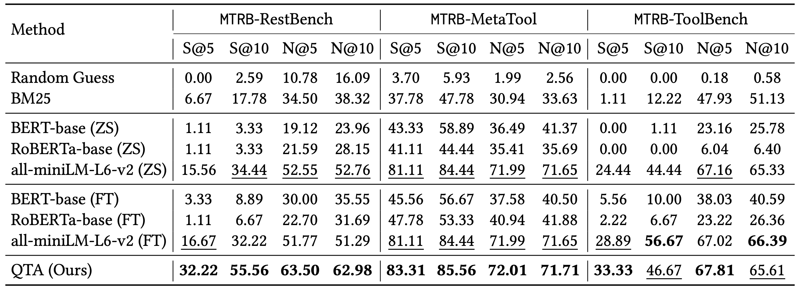
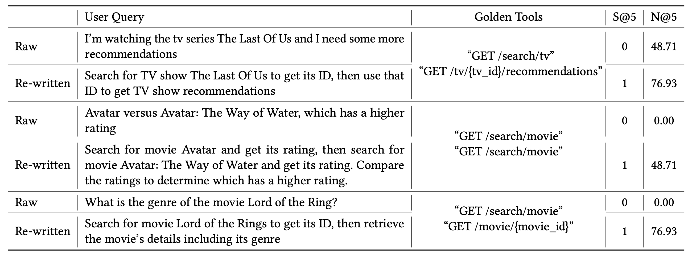

# MTRB-TQA

Data-Efficient Massive Tool Retrieval: A Reinforcement Learning Approach for Query-Tool Alignment with Language Models.

Recent advancements in large language models (LLMs) integrated with external tools and APIs have successfully addressed complex tasks by using in-context learning or fine-tuning. Despite this progress, the vast scale of tool retrieval remains challenging due to stringent input length constraints. In response, we propose a pre-retrieval strategy from an extensive repository, effectively framing the problem as the massive tool retrieval (MTR) task. We introduce
the MTRB (massive tool retrieval benchmark) to evaluate real-world tool-augmented LLM scenarios with a large number of tools. This
benchmark is designed for low-resource scenarios and includes a diverse collection of tools with descriptions refined for consistency and clarity. It consists of three subsets, each containing 90 test samples and 10 training samples. To handle the low-resource MTR task, we raise a new query-tool alignment (QTA) framework leverages LLMs to enhance query-tool alignment by rewriting user queries through ranking functions and the direct preference optimization
(DPO) method. This approach consistently outperforms existing state-of-the-art models in top-5 and top-10 retrieval tasks across the MTRB benchmark, with improvements up to 93.28% based on the metric Sufficiency@𝑘, which measures the adequacy of tool retrieval within the first 𝑘 results. Furthermore, ablation studies validate the efficacy of our framework, highlighting its capacity to optimize performance even with limited annotated samples. Specifically, our framework achieves up to 78.53% performance improvement in Sufficiency@𝑘 with just a single annotated sample. Additionally, QTA exhibits strong cross-dataset generalizability, emphasizing its potential for real-world applications.

## Background

The current approach to solving tool-based problems involves first addressing the (a) massive tool retrieval (MTR) task, followed by completing the (b) tool selection task. We focus on providing a solution for the MTR task. For evaluation, we introduce a new MTRB benchmark. Method-ologically, we propose a new QTA framework to enhance the retrieval systems by aligning user queries with tools.

## Statistics

General statistics of MTRB benchmark. Tool Doc. Lengths represent the length range of tool descriptions. The Golden Tools column indicates the number of essential tools selected as ground truth for each sub-task.

## Overview

An overview of the proposed QTA framework, which includes data pipelines for the training and inference stages. Specifically, we utilize an LLM to learn the alignment between user queries and tool document representations, thereby generating high-quality user queries. Additionally, we employ a frozen retrieval model to compute the similarity between the queries and the tool database.

## Results

Main results of MTRB benchmark, with the best score bolded and the second best scores underlined. The results are shown in percentages.

We compare various methods on MTRB bench- mark across three sub-task: MTRB-RestBench, MTRB-ToolBench, and MTRB-MetaTool. In summary, the proposed QTA framework achieves either the best or the second-best results across all metrics.

## Visualization 

Visualization results: user query before and after rewriting in MTRB-RestBench dataset.

As shown in Table 3, we present the before and after versions of three sets of user queries, detailing the changes in the 𝑆@5 and 𝑁@5 metrics. In summary, the QTA frame-work generates high-quality queries, resulting in improvement overretrieval models.
